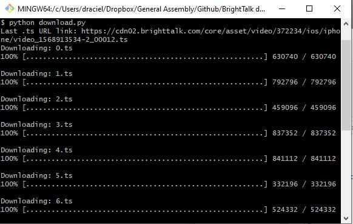

### BrightTalk downloader

Download videos from BrightTalk

### Example

Example in the Example folder

### Instructions

1. Download or git clone this repo
2. Download [ffmpeg](https://www.ffmpeg.org/download.html)
3. Edit the environment path to include ffmpeg.exe folder
4. Login to BrightTalk
5. Navigate to video page and obtain the URL of the last .ts packet
    1. Open chrome
    2. Open the developer tools in the top left or (cntrl + shift + i)
    3. Open the networks tab
    4. Toggle 'XHR'
    5. Filter by .ts
    6. Navigate to video page
    7. Drag video slider to the end
    8. Find the packet with the largest number
    9. Right click and copy URL


6. Run download.py

This downloads all the .ts files

```
python download.py
```



7. Run combine.sh

This uses ffmpeg to combine the .ts files

```
bash combine.sh
```


8. Run clean.sh

This removes the temp folder

```
bash clean.sh
```